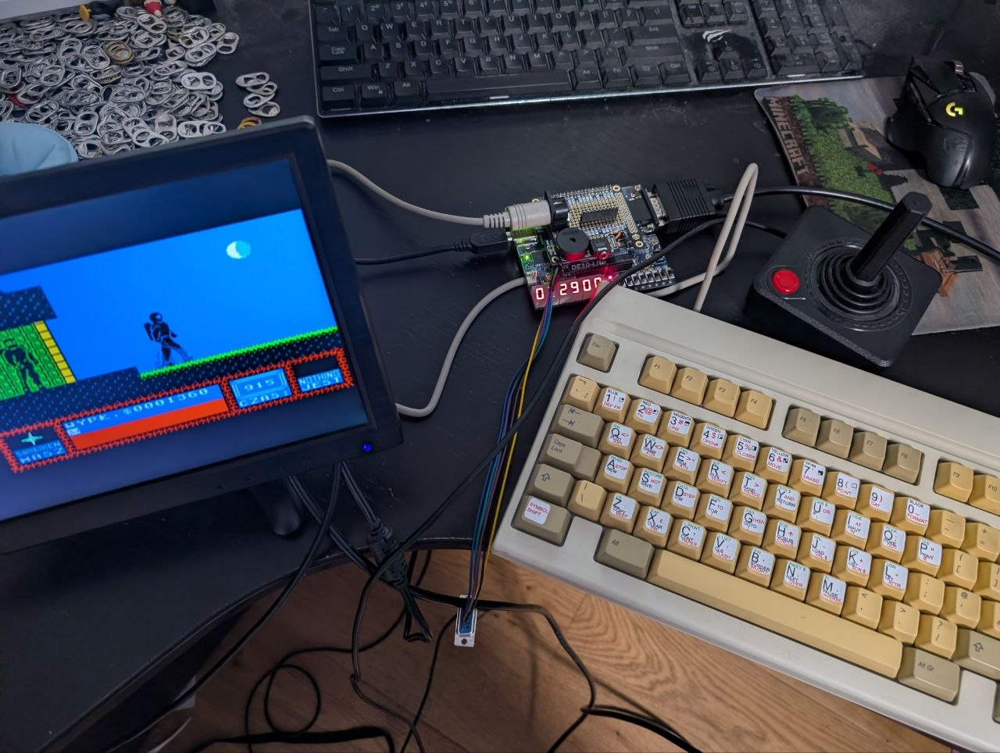
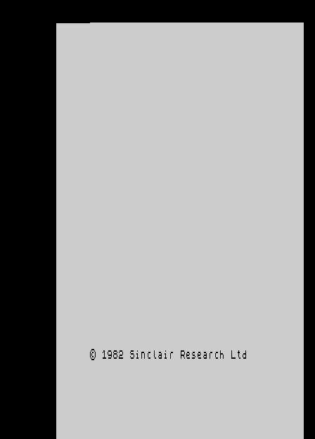
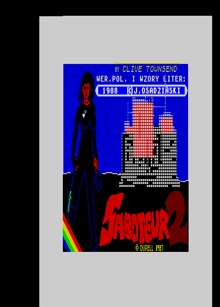
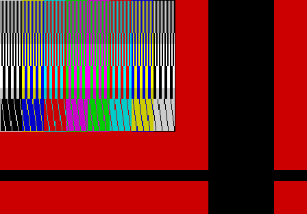

# speccy

A ZX Spectrum, built from scratch in Verilog, targeting a **Terasic DE10-Lite**
(Intel MAX 10, 50K LE).

The goal is deliberately modest and deliberately concrete: **run Saboteur II on a
real monitor, on hardware I built.** Not to own a Spectrum — to find out whether I
can make one.

## Status

**Phase 1 complete (2026-08-02): the 48K machine is done.** Keyboard (a
stickered AT board through a DIN-5 socket), Kempston joystick, beeper,
snapshot boot, and — in simulation, wiring pending — esxDOS loading from SD.
Saboteur II is played on it daily by people born four decades after its
release, which was the whole point.



*Saboteur II mid-game; DE10-Lite wearing its DIN-5/piezo hat; an AT keyboard
hand-stickered with Sinclair keyword legends; one Atari-pattern joystick,
still on active duty.*

**The machine boots.** TV80 executing the real 48K ROM against the full video
chain, captured by a testbench that locks onto the sync stream exactly as a
monitor would:



Nothing outside the FPGA design produced that image — CPU, ULA-equivalent, RAM
test, character rendering, scandoubler, sync. (`make boot ROM=path/to/48.rom`;
the ROM itself is not in this repo.)

And via the snapshot loader, the goal itself — Saboteur II resumed from a
`.z80` snapshot by a generated 60-byte bootstrap, no keys pressed:



The raster below is the earlier stage-0 view of the same video chain — the full
448×312 frame including blanking. The picture sits top-left because `hc=0` is the
first *displayed* pixel, so the left and top borders land at the far right and
bottom — which is, incidentally, exactly the mechanism that made the real
machine's picture sit off-centre.



The scandoubler turns that 15.625 kHz raster into a 31.25 kHz one a VGA monitor will
lock to, by reading each line back at twice the rate:

```
in : 448 x 312 @ 7 MHz    15.625 kHz line,  50.08 Hz frame
out: 448 x 624 @ 14 MHz   31.25  kHz line,  50.08 Hz frame
```

No rate matching is needed because the ratio is exactly 2:1 — one input line is 896
cycles of the 14 MHz clock, which is precisely two output lines of 448.

### Verification

`make run` is a test, not just a demo. Every frame it checks:

- exactly 139776 input pixels (448 × 312) and 279552 output pixels (448 × 624)
- output lines 2k and 2k+1 are byte-identical — the scandoubler's whole job
- the set of doubled lines matches the set of input lines

It exits non-zero on failure, so it works as a regression test as the design grows.

## Quick start

Everything up to stage 4 runs natively on macOS — no FPGA, no Quartus, no Windows.

```bash
brew install verilator
```

```bash
make run
```

Frames land in `out/` as BMP. Options:

```bash
make run FRAMES=40 SCR=path/to/screen.scr
```

`--scr` takes a standard 6912-byte `.scr` file; without it you get a synthetic test
pattern exercising pixel detail, all eight colours, BRIGHT and FLASH.

```bash
make test
```

`make test` runs the video checks and the joystick testbench. `make lint` runs
Verilator's linter over the simulation RTL.

## Layout

```
rtl/
  video_timing.v      448x312 raster, sync, blanking -- all parameterised
  video.v             screen addressing, fetch pipeline, attributes, border
  scandoubler.v       15.625 -> 31.25 kHz, ping-pong line buffers
  palette.v           4-bit colour index -> 4:4:4 RGB
  vram.v              true dual-port 16 KB screen bank
  joystick.v          DE-9 stick -> Kempston port byte
  keyboard.v          48K matrix, 8 half-rows on A8..A15
  ram.v               single-port RAM/ROM
  speccy.v            the machine minus CPU: memory map, ports, INT, video
  speccy48.v          the machine: TV80 in the socket
  tv80/               vendored TV80 Z80 core (MIT, one local change)
  speccy_video_top.v  simulation top level
  de10_lite_top.v     board wrapper (Quartus only -- vendor PLL)
quartus/              complete Quartus project: qpf, qsf (121 pins), sdc
sim/
  main.cpp            Verilator harness, BMP frame dump, .mif/.hex export
  joystick_tb.cpp     joystick testbench
  bus_tb.cpp          testbench acting as the Z80
  cpu_tb.cpp          TV80 smoke test
  boot_tb.cpp         virtual monitor: sync-locked capture of the full machine
docs/                 design notes (see below)
```

## Design

The reasoning behind the target, the fit analysis, and what was rejected:

- [Phase 1: 48K + divMMC](docs/20260727-phase1-48k-divmmc.md) — **the plan being built**
- [DE10-Lite bring-up](docs/20260727-de10-lite-bringup.md) — Quartus steps, PLL settings,
  joystick wiring, and what to check when it doesn't work
- [Which machine to build](docs/20260727-clone-lineage-and-target-choice.md) — Soviet clone
  lineage, and why a non-contended machine is the right target
- [Scorpion ZS-256 fit](docs/20260727-scorpion-on-de10-lite.md) — phase 2, where SDRAM
  becomes unavoidable
- [The real 48K](docs/20260727-ula-diagnosis-and-replacement.md) — diagnosing and replacing
  a physical ULA (parked)
- [Original 48K analysis](docs/20260726-full-spectrum-de10-lite.md) — superseded

Three decisions worth knowing without reading all of that:

**No memory contention.** Targeting Pentagon-style timing rather than a Ferranti 48K
removes the single hardest part of the project. Contention, floating bus and snow are
a months-long fidelity grind that Saboteur II does not need.

**Everything in block RAM.** 48 KB RAM + 16 KB ROM + divMMC fits in ~106 KB of the
DE10-Lite's ~180 KB of M9K, so there is no SDRAM controller and no arbiter anywhere.
Video reads screen memory in the same cycle as the CPU, exactly like real hardware.
"Stay in block RAM" and "stay at 48K" turn out to be the same decision — 128K is
precisely where SDRAM becomes unavoidable.

**divMMC for storage, not an FDC.** An SPI port plus paging traps, with esxDOS (Z80
software) doing the filesystem work. Roughly 500 LE instead of a WD1793 emulation.

## Roadmap

- [x] **0** — video generator + Verilator harness
- [x] **1a** — scandoubler, 15.625 → 31.25 kHz
- [x] **1c** — Kempston joystick (no CPU needed — it's five switches to ground)
- [x] **1b/2** — superseded: hardware bring-up jumped straight to the full
  machine (3d), which subsumed both
- [x] **3a** — machine around the CPU socket: memory map, ULA ports, keyboard
  matrix, Kempston decode, 50 Hz INT — verified by a testbench acting as the Z80
- [x] **3b** — TV80 core vendored and in the socket; smoke-test ROM confirms
  fetch/execute, OUT, writes to all banks, and IM 1 servicing one INT per frame
- [x] **3c** — real 48K ROM boots to © 1982 in simulation
- [x] **3d** — **and on the real board** (2026-07-27, first-try bring-up: PLL,
  pins and 50.08 Hz-over-VGA all worked unmodified)
- [x] **3e** — PS/2 receiver + scancode→matrix mapper; the testbench types
  `10 P"hello"` / `R` into the real ROM over simulated PS/2 traffic and BASIC
  runs it (`make boot ROM=48.rom TYPE='...'`)
- [x] **3f** — the physical keyboard: AT (DIN-5) after two dead PS/2 ends —
  same protocol, older connector, working (2026-08-02)
- [x] **3g** — snapshot loader: `.z80` → block RAM + a generated register-restore
  stub served from a boot overlay. `make snap SNAP=game.z80 ROM=48.rom` boots it
  in simulation; on hardware, SW[1] + reset boots straight into the game
- [x] **4** — beeper: piezo direct-drive + line-out divider
- [x] **5 (sim)** — divMMC + esxDOS 0.8.9 boots in simulation: FAT16 mount,
  NMI browser, four protocol lessons in the stage-5 doc
- [ ] **5 (hw)** — six wires to the SD breakout + recompile → games from card

Phase 2, if it stays interesting: SDRAM, 128K paging, AY, and eventually the
Scorpion's extended paging, 7 MHz turbo and that excellent ROM-resident debugger.

## Hardware

DE10-Lite, plus three things the board lacks: a **PS/2 keyboard** (two GPIO pins;
note MAX 10 is not 5V tolerant, and passive USB→PS/2 adapters won't work with modern
keyboards), a **microSD breakout**, and a resistor and capacitor into a 3.5 mm jack
for the 1-bit beeper.

Clocking is a happy accident: 50 × 7/25 = 14 MHz exactly, so the board's 50 MHz
oscillator gives a Spectrum master clock from a PLL with no fractional-N awkwardness.

Simulation runs on macOS; synthesis needs Quartus Prime Lite, which is Windows/Linux
x86-64 only.

## ROMs

Not included and not committed. The 48K ROM is Amstrad's — freely distributed for
emulation, but not mine to redistribute — and esxDOS has its own terms. Supply them
locally.

## References

- Chris Smith, *The ZX Spectrum ULA: How to Design a Microcomputer* — gate-by-gate
  reverse engineering, and the reason any of this is possible
- **ZX-UNO** — the closest prior art to this situation: small FPGA, no host CPU,
  divMMC in HDL
- **MiSTer** — vastly larger scope, and its Spectrum core assumes an ARM host for
  anything touching files, but good reference for video and AY
