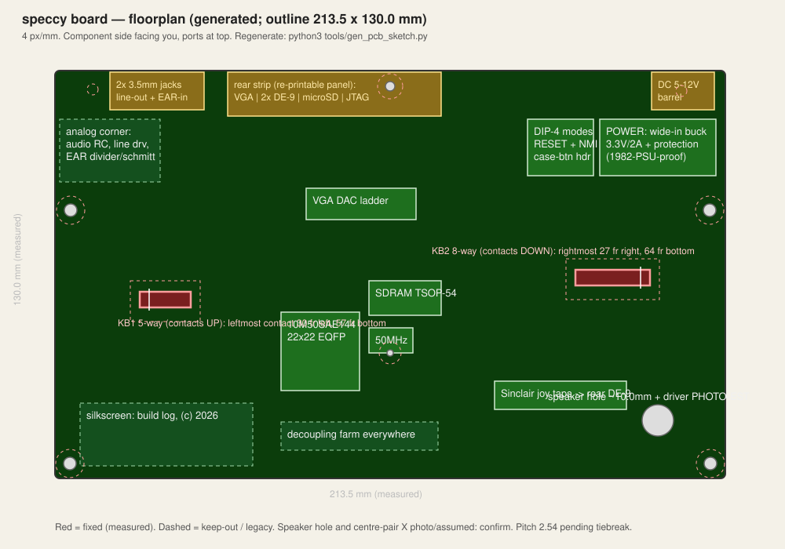
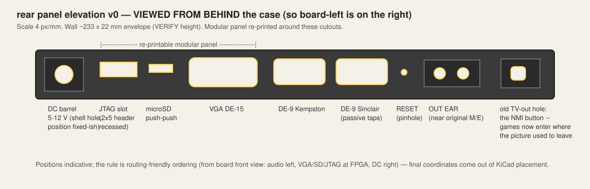

# The board gets drawn: PCB sketch v0

*2026-09-11 — the Issue Two is in the case, the machine is proven on the
DE10-Lite, and the custom board (per the 2026-08-03 evaluation: skip the
carrier, go straight to 10M50SAE144 + PCBA) gets its first floorplan.*

## The one immovable feature: the keyboard tail sockets

With the rear panel confirmed re-printable, the constraint hierarchy
inverts: **rear connectors go wherever routing likes** (the panel is
printed around the board), while the **two keyboard tail sockets are the
only components whose XY is dictated from outside** -- the case
keyboard's membrane tails are short and stiff and arrive exactly where
the Issue Two's slots are. The original PCB connectors are in hand and
solder easily; their slot centers (and the tails' insertion depth and
orientation) get measured to the tenth of a millimetre and frozen first,
before anything else is placed. Mounting bosses are the other fixed set;
everything else on the board is negotiable.

## Measured so far (the numbers that are now law)

Frame: component side facing you, ports at top, keyboard edge at bottom.

- Board outline: **211.5 x 130 mm** (measured; the folkloric 233 x 144
  was wrong).
- **KB1 (5-way)**: leftmost contact **30 mm from the LEFT edge,
  56 mm from the bottom edge** (57 revised down 1 mm after the 1:1
  print against the solder side).
- **KB2 (8-way)**: rightmost contact **27 mm from the RIGHT edge,
  64 mm from the bottom edge**.
- The slots flank the board; the corridor between their inner ends
  hosts the FPGA/SDRAM/oscillator (floorplan v0.4).
- Confirmed against the case keyboard itself: underside photo shows the
  8-way tail on the (mirrored) right, 5-way on the left, both tails
  ~8 cm -- positions are dictated, as suspected.
- **Contact pitch ~2.5 mm** (macro photo against a steel ruler: 4 joints
  per cm). To settle 2.54 vs 2.50: caliper the first-to-last contact
  span -- 5-way: 10.16 vs 10.00 mm; 8-way: 17.78 vs 17.50 mm.
- **Contact faces oppose**: the 5-way socket's contacts are on the TOP,
  the 8-way's on the BOTTOM (as the user holds it, ports-up frame).
  The two tails insert printed-face opposite ways -- footprint
  orientation per slot is now recorded and must be honoured.
- Mounting, the full used set (measured): **two 4 mm holes at
  mid-sides, 5 mm in from each side edge, 44.5 mm from the top edge
  to centre** (the case's main fixings, symmetric); a 2 mm board-mount
  at centre, 40 mm from the bottom; a 3 mm case-bolt pass-through 5 mm
  from the top (non-plated, mask-free, all-layer keep-out). Two more
  4 mm holes at the bottom corners, 4.5-5 mm from both closest edges.
  The top-corner holes near the modulator and the barrel exist on the
  Issue Two but are UNUSED by this case -- carried as optional legacy
  holes for compatibility, nothing routed near them. Hole census:
  seven real (2x4mm sides, 2x4mm bottom corners, 2mm centre, 3mm top
  bolt pass) plus two legacy.

Still to measure: X of the centre hole and top bolt (assumed centred);
the pitch tiebreak spans above; rear wall envelope.

## Mechanical strategy: the Issue Two on the desk is the datum

The board photographed in the case is the golden reference — better than
any repo. Everything positional gets **measured off it with calipers**:

1. Outline: length × width (nominally ~233 × 144 mm — verify).
2. Mounting-hole centers, from the front-left corner (and the count —
   issues differ; the case only cares about the bosses it has).
3. The two keyboard tail slots: center positions along the front edge.
   These are the one *functionally* fixed constraint — the case's
   membrane tails arrive exactly there.
4. DC jack center on the rear edge (we reuse the case aperture).
5. EAR/MIC jack centers (reused as line-out + future EAR-in).
6. Rear wall envelope: openable span and height of the modular panel
   region (the panel itself is re-printed around our connectors, so
   only the envelope matters -- confirmed modular 2026-09-11).

Cross-checks available online: the Harlequin rev G / Superfo 128
(case-fit clone) and the issue-6A restoration replica, both published;
ZX48K-Essentials is in KiCad and case-targeted. Lift, compare, trust
the calipers on disagreement.

## Landmark-for-landmark repurposing

| Issue Two had | Our board puts there | Why |
| --- | --- | --- |
| ASTEC modulator (top-left bay) | Audio filter/driver + EAR-in conditioning | quiet corner, next to the jacks, aperture unused |
| EAR/MIC 3.5 mm jacks | Line-out + EAR-in, same holes | case fit, phase-2 tape input becomes a socket |
| Expansion edge aperture | Rear connector strip: VGA, Kempston DE-9, microSD, JTAG | the widest hole Sinclair left us; repro cases have replaceable rear panels |
| 9 V DC barrel (top-right) | 5–12 V DC in, same hole | see power |
| 7805 + heatsink (mid-left) | nothing — a buck lives by the jack | 2026 called |
| ULA/CPU/RAM acreage | 10M50SAE144 + SDRAM + oscillator | the whole computer in ~15 cm² |
| Keyboard tail slots (front) | The same slots, original sockets (spares in the drawer) | electrically identical matrix |

## Electrical sketch

- **FPGA**: 10M50SAE144C8G, single 3.3 V supply, internal config flash
  (instant-on — no flash chip, no bring-up debt there). ~50 signals used
  of ~101.
- **Power**: wide-input buck (4.5–17 V in, 3.3 V / 2 A out) straight off
  the barrel, with polyfuse and reverse protection. Deliberate feature:
  **an original Sinclair 9 V PSU just works** — the case's period power
  brick becomes usable instead of dangerous.
- **SDRAM**: W9825G6KH-6 (32 MB SDR, TSOP-54, 3.3 V) — same protocol as
  the DE10-Lite chip our controller already drives; placed tight against
  the FPGA, length-matching unnecessary at 14 MHz but keep the bus short.
- **Clock**: 50 MHz 3.3 V oscillator; PLL settings carry over unchanged.
- **VGA**: the DE10-Lite's 4:4:4 resistor ladder, copied; resistors
  placed against the connector.
- **Keyboard**: 8+5 matrix through the original tail sockets; 13 FPGA
  pins, pull-ups in fabric or discrete. The PS/2 DIN-5 is *not* carried
  over (the AT keyboard retires when the case keyboard arrives — one
  fewer 5 V domain; the board is 3.3 V-only).
- **Joysticks**: Kempston DE-9 on the rear strip (5 pins); Sinclair DE-9
  #2 as passive matrix taps near the keyboard lines — zero pins.
- **SD**: push-push microSD, 4-wire SPI, pull-ups.
- **Audio**: sigma-delta pin → RC → line-out jack; EAR-in jack →
  divider + Schmitt → one pin (phase-2 tape, socket ready from day one).
- **Controls**: the case hides everything, so — DIP-4 (divMMC / force-48K
  / snapshot / AY-YM), reset + NMI tactiles reachable through the rear
  slot, plus a pin header to relocate NMI to a case-top button later.
- **LEDs**: power, SD activity, one status; a light pipe to the case is
  optional romance.

## Stackup and routing

4-layer: signal / GND / 3.3 V / signal. The fastest thing on the board
is 14 MHz SDRAM (71 ns cycles) — routing is electrically trivial; the
work is mechanical exactness and a clean decoupling farm (100 nF per
power pin + bulk per rail, pour stitched). The AY is inside the FPGA;
the only analog is the audio RC and the VGA ladder — both live at their
connectors, away from the buck.

## Order of work

1. **Caliper session** on the Issue Two (list above) → outline DXF.
2. Cross-check against Harlequin/Essentials KiCad outlines.
3. KiCad 9 project in `pcb/`: outline + holes + tail slots first —
   print 1:1 on paper, lay it in the case, iterate until it drops onto
   the bosses and the tails reach.
4. Schematic (blocks above), then placement per this floorplan.
5. Rev A gerbers + PCBA quote (JLC, global-sourced FPGA); DNP generosity
   on anything doubtful.

The RTL doesn't change at all for this board — pin table only, and the
DE10-Lite remains the lab mule that proves every change first.
